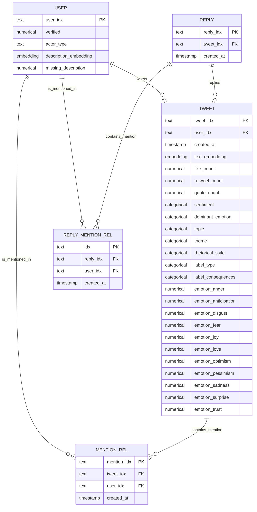

# Preprocessed Schema

## User (Dimension Table)

* We only use users who have at least tweeted or mentioned in a tweet once.
* File name: `users.parquet`

**PK:** `user_idx` · **FK:** none · **time_col:** none

| Column                  | Dtype           | Preprocessing                                                             |
|-------------------------|-----------------|---------------------------------------------------------------------------|
| `user_idx`              | string          | Identical to column `username`. Check there is no duplicates.             |
| `username`              | string          | No change needed. For later reference purpose. **not a feature**          |
| `verified`              | int 0/1         | Cast from object, fill nulls with 0                                       |
| `actor_type`            | categorical str | No change needed, fully populated                                         |
| `description_embedding` | float[384]      | Encode raw `description` with SentenceTransformer; null for ~63% of users |
| `missing_description`   | int 0/1         | Flag for null descriptions (for learnable mask strategy)                  |

---

## Tweet (Fact Table)

* File name: `tweets.parquet`
**PK:** `tweet_idx` · **FK:** `user_idx` → User · **time_col:** `created_at`

| Column                 | Dtype            | Preprocessing                                                            |
|------------------------|------------------|--------------------------------------------------------------------------|
| `tweet_idx`            | str              | No change needed. Check there is no duplicates.                          |
| `conversation_id`      | str              | Identical to `tweet_idx`. For later reference purpose. **not a feature** |
| `user_idx`             | str  FK → User   | FK to `User` table                                                       |
| `created_at`           | pd.Timestamp     | Parse from string; used as time_col only, **not a feature**              |
| `text_embedding`       | float[384]       | Encode raw `text` with SentenceTransformer                               |
| `like_count`           | float            | Fill nulls with 0.0                                                      |
| `retweet_count`        | float            | Fill nulls with 0.0                                                      |
| `quote_count`          | float            | Fill nulls with 0.0                                                      |
| `sentiment`            | categorical str  | Fill nulls with "unknown"                                                |
| `dominant_emotion`     | categorical str  | Fill nulls with "unknown", so even it's false we can still use it        |
| `topic`                | categorical str  | Fill nulls with "unknown"                                                |
| `theme`                | categorical str  | Fill nulls with "unknown"                                                |
| `rhetorical_style`     | categorical str  | Fill nulls with "unknown"                                                |
| `label_type`           | categorical str  | Fill nulls with "unknown"                                                |
| `label_consequences`   | categorical str  | Fill nulls with "unknown"                                                |
| `emotion_anger`        | int 0/1          | Cast from bool                                                           |
| `emotion_anticipation` | int 0/1          | Cast from bool                                                           |
| `emotion_disgust`      | int 0/1          | Cast from bool                                                           |
| `emotion_fear`         | int 0/1          | Cast from bool                                                           |
| `emotion_joy`          | int 0/1          | Cast from bool                                                           |
| `emotion_love`         | int 0/1          | Cast from bool                                                           |
| `emotion_optimism`     | int 0/1          | Cast from bool                                                           |
| `emotion_pessimism`    | int 0/1          | Cast from bool                                                           |
| `emotion_sadness`      | int 0/1          | Cast from bool                                                           |
| `emotion_surprise`     | int 0/1          | Cast from bool                                                           |
| `emotion_trust`        | int 0/1          | Cast from bool                                                           |

---

## Reply (Fact Table)

* File name: `replies.parquet`
**PK:** `reply_idx` · **FK:** `tweet_idx → Tweet · **time_col:** `created_at`

| Column           | Dtype          | Preprocessing                                                            |
|------------------|----------------|--------------------------------------------------------------------------|
| `reply_idx`      | str            | No change needed. Check there is no duplicates.                          |
| `reply_id`       | str            | Identical to `reply_idx`. For later reference purpose. **not a feature** |
| `tweet_idx`      | str FK → Tweet | FK to `Tweet` table                                                      |
| `created_at`     | pd.Timestamp   | Parse from Neo4j DateTime; used as time_col only, **not a feature**      |

---

## mention_rel (Bridge Table)

* File name: `mention_rel.parquet`
**PK:** `mention_idx` · **FK:** `user_idx` → User, `tweet_idx` → Tweet · **time_col:** `created_at`

| Column        | Dtype          | Preprocessing                                                    |
|---------------|----------------|------------------------------------------------------------------|
| `mention_idx` | str PK         | mention ID                                                       |
| `tweet_idx`   | str FK → Tweet | From `link_type == "mentions"` rows, mapped via `tweetid_to_idx` |
| `user_idx`    | str FK → User  | Map mentioned `username`                                         |
| `created_at`  | pd.Timestamp   | Copied from tweet's `created_at`                                 |

---

## Schema visualization

## reply_mention_rel (Bridge Table)

* File name: `reply_mention_rel.parquet`
**PK:** `idx` · **FK:** `user_idx` → User, `reply_idx` → Reply · **time_col:** `created_at`

| Column       | Dtype          | Preprocessing                    |
|--------------|----------------|----------------------------------|
| `idx`        | str PK         | reply mention ID                 |
| `reply_idx`  | str FK → Reply | Map to `reply_idx`               |
| `user_idx`   | str FK → User  | Map mentioned `username`         |
| `created_at` | pd.Timestamp   | Copied from reply's `created_at` |

---

## Temporal Splits 1 (Mention prediction)
* Train: 70% (Tweet), 68.5% (Mention)
* Val: 15% (Tweet), 15.8% (Mention)
* Test: 15% (Tweet), 15.7% (Mention)
* `val_timestamp`: 2019-09-01
* `test_timestamp`: 2019-11-01

---